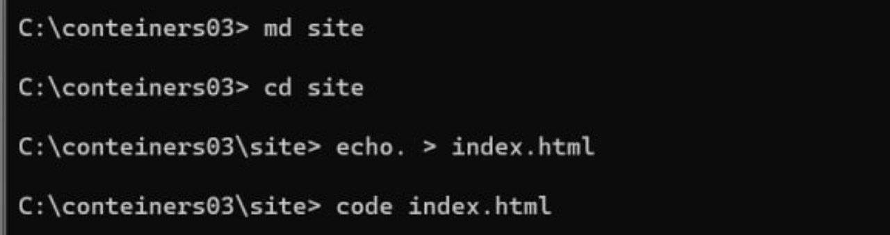

# Лабораторная работа №3. 
# Первый контейнер
 
 - **Diaconita Natalia, I2302** 

## Цель работы

Данная лабораторная работа знакомит с основами контейнеризации и подготавливает рабочее место для выполнения следующих лабораторных работ.

## Задание

Установить Docker Desktop и проверить его работоспособность.

## Описание выполнения работы с ответами на вопросы

### Подготовка

1. Скачиваю и устанавливаю Docker Desktop с официального сайта. 


2. Убеждаюсь в том, что докер установлен вылолнив команду `docker --version`


### Выполнение

1. Создаю репозиторий `conteiners03` и склонирую его себе на компьютер.


2. Создаю в папке `conteiners03` файл `Dockerfile` со следующим содержимым:

```
FROM debian:latest
COPY ./site/ /var/www/html/
CMD ["sh", "-c", "echo hello from $HOSTNAME"]
```


3. В той же папке проекта создаю папку `site`. В новой папке создаю файл `index.html` с произвольным содержимым.



### Запуск и тестирование

1. Открываю терминал в папке `conteiners03` и выполняю команду:

`docker build -t conteiners03 .`


*Сколько времени создавался образ?* 

 **45.1s**

2. Выполняю команду для запуска контейнера:

`docker run --name containers02 containers02`

*Что было выведено в консоли?*


В консоли выводится строка hello from + первые 12 символа идентификатора контейнера.

3. Удаляю контейнер и запускаю снова, выполнив команды:

```
docker rm containers02
docker run -ti --name containers02 containers02 bash
```

4. В открывшемся окне выполняю команды:
```
cd /var/www/html/
ls -l
```

*Что выводится на экране?*

Команда ls -l выводит список файлов в /var/www/html/, включая их размер, владельца, права доступа и дату изменения. В результате видно, что файл index.html успешно скопирован.

5. Закрываю окно командой `exit`.

## Выводы

В рамках лабораторной работы была установлена и настроена среда Docker Desktop. Создан Docker-образ на базе debian:latest с загруженными файлами сайта, успешно выполнена его сборка и запуск. Проверена корректность передачи данных и функционирование встроенных команд. В результате приобретены базовые навыки контейнеризации, которые будут полезны в будущих проектах.

## Используемые источники

- [Официальная документация Docker](https://docs.docker.com/)
- [Docker Hub](https://hub.docker.com/)
- [Учебное руководство по Docker](https://www.digitalocean.com/community/tutorials/how-to-install-and-use-docker-on-ubuntu-20-04)
- [Руководство по написанию Dockerfile](https://docs.docker.com/engine/reference/builder/)

